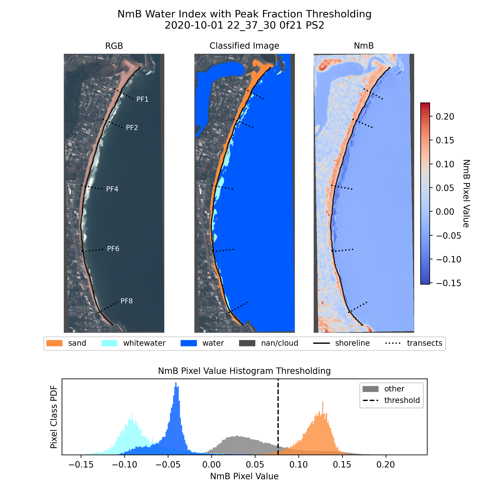
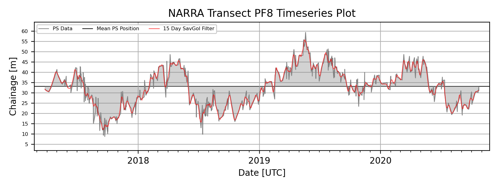

# CoastSat.PlanetScope

Yarran Doherty, UNSW Water Research Laboratory, 01/2021


## **Description**

CoastSat.PlanetScope is an open-source extension to the CoastSat python toolkit enabling users to extract time-series of shoreline position from PlanetScope Dove satellite imagery. Similar to CoastSat, the CoastSat.PlanetScope extension utilises a machine-learning shoreline detection algorithm to classify images into sand, water, whitewater and other pixel classes prior to a sub-pixel shoreline extraction process. An additional co-registration step is implemented to minimise the impact of geo-location errors. Transect intersection and a tidal correction  based on a generic beach slope is then applied to provide a timeseries of shoreline position. 



Output files include:
- Shoreline timeseries .geojson file for use in GIS software (no tidal correction)
- Tidally corrected shoreline transect intersection timeseries csv
- Image shoreline extraction plots
- Tidally corrected transect timeseries plots


## **Installation**

For users of Coastsat, the CoastSat.PlanetScope toolkit may be run in the original CoastSat environment once the following packages are installed:
- [Rasterio](https://rasterio.readthedocs.io/en/latest/installation.html)
- [AROSICS](https://danschef.git-pages.gfz-potsdam.de/arosics/doc/installation.html)

For first time users or where rasterio/arosics installation issues arise, a coastsat_ps environment may be installed using the provided environment.yml file. The easiest method of installation is using Anaconda which can be downloaded [here](https://www.anaconda.com/). Once Anaconda is installed, open Anaconda Prompt and navigate to the local downloaded CoastSat.PlanetScope repo folder by entering "cd C:\add\filepath\here\to\CoastSat.PlanetScope". Once this has been done, enter the following commands one by one to install the planetscope environment from the provided .yml file:

```
conda env create -f environment.yml -n coastsat_ps

conda activate coastsat_ps

spyder
``` 
Once spyder is open, navigate to the CoastSat.PlanetScope folder to set the working direcctory (top right hand box in spyder) and open the CoastSat_PS.py file to begin the example run through. Note that every time you want to run the code, you will need to activate the coastsat_ps environnment and open spyder using the last two lines of code above. 


## **Data Requirements**

PlanetScope images must be manually downloaded by the user. 
- It is recommended this be done using the [QGIS Planet plugin](https://developers.planet.com/docs/integrations/qgis/quickstart/) which enables users to crop images to a user defined area of interest prior to download to reduce image file size. 
- Access to PlanetScope imagery can be obtained through a [free trial](https://www.planet.com/trial/), [research license](https://www.planet.com/markets/education-and-research/) or [paid subscription](https://www.planet.com/contact-sales/#contact-sales).
- Required PlanetScope file type is '4-band multispectral Analytic Ortho Scene'. Using the QGIS plugin, filter for "PlanetScope Scene" and download "Analytic Radiance (TOAR) 4-band GeoTiff" images. It is recommended to select the 'clip to AOI' options to reduce file size. 
- To run CoastSat.PlanetScope, keep all downloaded images and associated metadata in a single folder and outline this folder filepath in the CoastSat_PS.py settings.

All user input files (area of interest polygon, transects & tide data) should be saved in the folder "...CoastSat.PlanetScope/user_inputs"
- Analysis region of interest .kml file may be selected and downloaded using [this tool](http://geojson.io). 
- Transects .geojson file (optional) should match the user input settings epsg. If skipped, transects may be drawn manually with an interactive popup. Alternately, the provided NARRA_transect.geojson file may be manually modified in a text editor to add/remove/update transect names, coordinates and epsg. 
- Tide data .csv for tidal correction (optional) should be in UTC time and local mean sea level (MSL) elevation. See NARRA_tides.csv for csv data and column name formatting. 

Beach slopes for the tidal correction (step 5) can be extracted using the [CoastSat.Slope toolkit](https://github.com/kvos/CoastSat.slope)


## **Usage**



It is recommended the toolkit be run in spyder. Ensure spyder graphics backend is set to 'automatic' for proper interactive plot rendering. 
- Preferences - iPython console - Graphics - Graphics Backend - Backend - Automatic

CoastSat.PlanetScope is run from the CoastSat_PS.py file. 
- Instructions and comments are provided in this file for each step. 
- It is recommended steps be run as individual cells for first time users. 

Settings and interactive steps are based on the CoastSat workflow and will be familiar to users of CoastSat. 

Interactive popup window steps include:
- Raw PlanetScope reference image selection for co-registration [step 1.2.]
- Top of Atmosphere merged reference image selection for shoreline extraction [step 2.1.]
- Reference shoreline digitisation (refer 'Reference shoreline' section of CoastSat readme for example) - [step 2.1.]
- Transect digitisation (optional - only if no transects.geojson file provided) - [step 2.1.]
- Manual error detection (optional - keep/discard popup window as per CoastSat) - [step 3.]

Results and plots are saved in '...CoastSat.PlanetScope/outputs/site_name/shoreline outputs'. 


## **Training Neural-Network Classifier**

Due to the preliminary stage of testing, validation was primarily completed at Narrabeen-Collaroy beach in Sydney, Australia. As such, the NN classifier is optimised for this site and may perform poorly at alternate sites with differing sediment composition. It is recommended a new classifier be trained for such regions. 

Steps are provided in "...CoastSat.PlanetScope/coastsat_ps/classifier/train_new_classifier.py". 
- Instructions are in this file and based of the CoastSat classifier training [methods](https://github.com/kvos/CoastSat/blob/master/doc/train_new_classifier.md). 
- CoastSat.PlanetScope must be run up to/including step 1.3. on a set of images to extract co-registered and top of atmosphere corrected scenes for classifier training. 


## **Validation Results**

- Accuracy validated against in-situ RTK-GPS survey data at Narrabeen-Collaroy beach in the Northen beaches of Sydney, Australia with a RMSE of 3.5m (n=438). 
- An equivelent validation study at Duck, North Carolina, USA provided an observed RMSE error of 4.7m (n=167). 

Detailed results and methodology outlined in:

Doherty Y., Harley M.D., Splinter K.D., Vos K. (2022). A Python Toolkit to Monitor Sandy Shoreline Change Using High-	Resolution PlanetScope Cubesats. Environmental Modelling & Software. https://doi.org/10.1016/j.envsoft.2022.105512

As a starting point for user validation studies, an example jupyter notebook comparing CoastSat (Landsat/Sentinel-2) shorelines against in-situ survey data can be found on the main [CoastSat](https://github.com/kvos/CoastSat) repo for Narrabeen-Collaroy beach. Note that CoastSat.PlanetScope results will require re-structuring to match the CoastSat validation input format. 


## **Development Opportunities**
- Currently the Planet provided udm2 useable pixel filter is not supported and a conversion into the old udm format is used. An updated udm2 processing step may improve cloud and sensor error detection. 
- The PSB.SD sensor type (see [here](https://developers.planet.com/docs/apis/data/sensors)) was released while this project was in its final stages of development. Utilisation of these additional 4 image bands may be an opportunity to further improve shoreline accuracy. 
- Additional vallidation and comparison studies:
  - Comparison between the three PlanetScope Dove sensor types (PS2, PS2.SD and PSB.SD)
  - Vallidation and testing at additional sites globally 
  - Testing along non-sandy coastlines


## **Known Issues & Workarounds**

The following issues have been identified by users and workarounds are presented below. My availability to maintain and update this repo is limited so user feedback, bug fixes and devlopments are encouraged! 
- Inability to select reference image - comment out [this](https://github.com/ydoherty/CoastSat.PlanetScope/issues/2#issuecomment-828644872) section of code. See [here](https://github.com/ydoherty/CoastSat.PlanetScope/issues/2#issuecomment-840894375) for explanation.  
- Environment installation issues and package conflicts - see [here](https://github.com/ydoherty/CoastSat.PlanetScope/issues/2#issuecomment-830543064). Seems to be resolved for both mac and windows. Unexpected installation issues may still persist so an alternate installation environment (environment_alt.yml) is provided in the event the standard file does not work. 
- Arosics raises an error when running cell 1.3 (image co-registration) in spyder on windows. This appears to be due to the way arosics handles multiprocessing on the windows operating system. A workaround is to copy and run the code directly in the spyder console or to run using a selection and F9. Instructions are provided in cell 1.3. 
- For regions where downloaded images do not all have the same CRS/epsg, the arosics co-registration step will fail and provide an error message. If this occurs, edit the file CoastSat.PlanetScope > coastsat_ps > data_import.py file on line 37 to change the arosics_reproject setting to True. 
- If the toolbox repeatedly crashes on an individual image, inspect the file in GIS software to ensure there are no issues with the image. For impacted images, the easiest workaround is to delete the image (and all assoicated files) from the downloads folder and re-run the toolbox. 
- To remove all files created by the toolbox in order to start fresh, simply delete the CoastSat.PlanetScope > outputs > RUN_NAME folder. 
